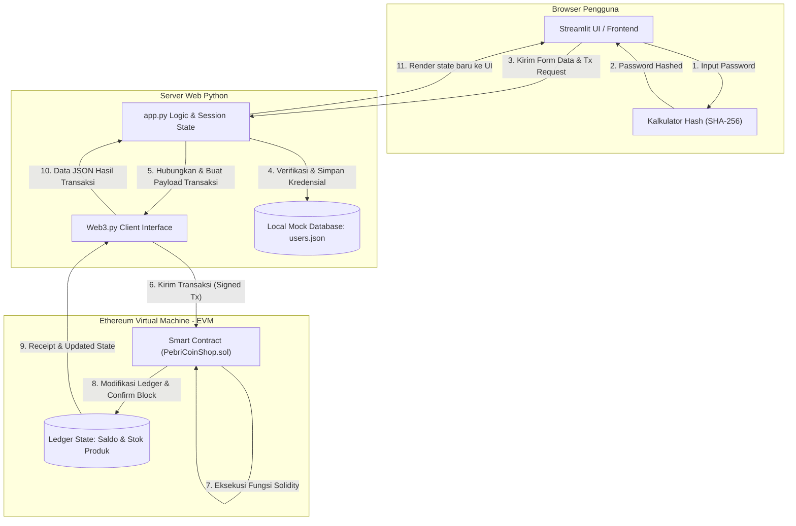
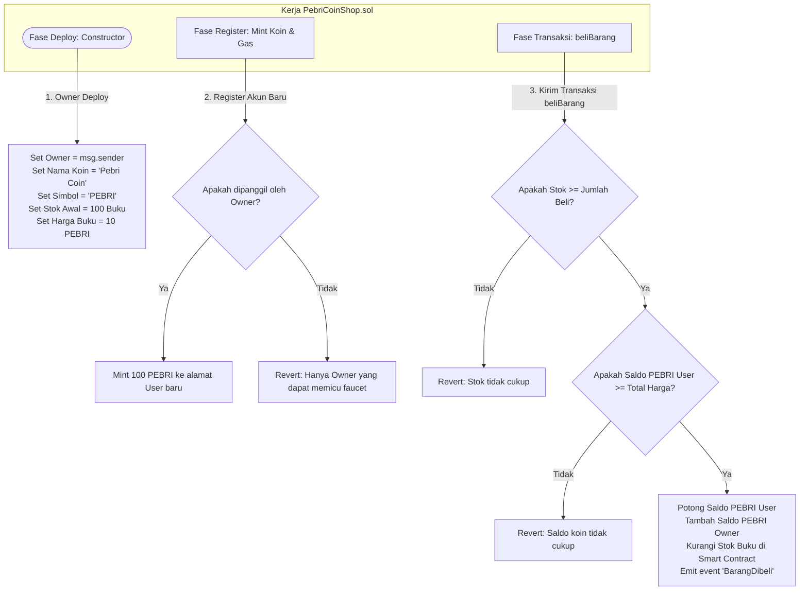

# 🪙 Pebri Coin Shop - Simulasi Web3 & Kriptografi Edukasi

Selamat datang di **Pebri Coin Shop**! Proyek ini dirancang sebagai alat bantu mengajar dan simulasi interaktif untuk mahasiswa guna memahami dasar-dasar teknologi blockchain, kriptografi, pembuatan wallet, gas fee, interaksi smart contract, dan client-side signing.

Aplikasi ini menyediakan visualisasi real-time bagaimana sebuah password diubah menjadi nilai hash, bagaimana transaksi blockchain ditandatangani secara kriptografis menggunakan kunci privat (Private Key), hingga visualisasi interaktif alur transaksi masuk ke dalam blok di blockchain.

---

## 🛠️ 1. Cara Menjalankan Project (Installation & Setup)

Mahasiswa dapat menjalankan aplikasi ini menggunakan **Blockchain Node Lokal (Ganache/Anvil)** untuk konfirmasi transaksi instan, atau menghubungkannya ke **Testnet Publik (seperti Sepolia)**.

### A. Langkah Pembuatan File / Kloning Repositori
1. Unduh file proyek ke direktori kerja Anda atau klon repositori proyek:
   ```bash
   git clone <URL_REPOSITORI_ANDA>
   cd smart-contract
   ```
2. Pastikan file utama seperti `app.py` (Streamlit), `PebriCoinShop.sol` (Solidity), `compile_contract.py`, `deploy.py`, dan `server.py` berada di dalam direktori ini.

### B. Instalasi Dependensi Python
Instal seluruh pustaka Python yang diperlukan (seperti `streamlit` untuk antarmuka web, `web3` untuk interaksi RPC node, dan `eth-account` untuk manajemen kunci dompet):
```bash
pip install -r requirements.txt
```
*Atau lakukan instalasi manual:*
```bash
pip install streamlit flask web3 eth-account py-solc-x
```

### C. Menjalankan Blockchain Node Lokal (Ganache/Anvil)
Agar simulasi transaksi berjalan instan, jalankan simulator node lokal pada port default `8545`:
* **Opsi 1: Ganache CLI (via Node.js/npm)**
  ```bash
  npx ganache-cli
  ```
* **Opsi 2: Anvil (Foundry)**
  ```bash
  anvil
  ```
Node lokal akan berjalan di `http://127.0.0.1:8545` dan menyediakan 10 akun awal yang masing-masing berisi 100 ETH gratis untuk pengujian.

### D. Kompilasi & Deploy Smart Contract
Anda dapat mendeploy smart contract menggunakan script otomatis bawaan proyek atau secara manual via Remix IDE.

#### Opsi 1: Menggunakan Script Python Otomatis (Direkomendasikan untuk Lokal)
1. Kompilasi contract Solidity ke ABI & Bytecode:
   ```bash
   python3 compile_contract.py
   ```
2. Deploy contract ke node lokal yang sedang berjalan:
   ```bash
   python3 deploy.py
   ```
   *Script ini secara otomatis mendeploy contract menggunakan Akun 0 (Owner) dan menghasilkan berkas `config.json` dan `contract_data.json`.*

#### Opsi 2: Menggunakan Remix IDE (Untuk Testnet Publik/Sepolia)
1. Buka [Remix IDE](https://remix.ethereum.org/).
2. Buat file baru `PebriCoinShop.sol` dan tempelkan kode Solidity dari proyek ini.
3. Di panel compiler, pilih compiler versi **0.8.20** dan pada konfigurasi tingkat lanjut (*Advanced Configuration*), ubah **EVM Version** menjadi **Paris** (untuk menghindari error instruksi `PUSH0` pada emulator lokal lama). Klik **Compile**.
4. Di panel deploy, ubah environment menjadi **Injected Provider - MetaMask** (pastikan dompet MetaMask Anda terhubung ke jaringan Sepolia). Klik **Deploy**.
5. Setelah sukses, salin **Contract Address** dan **ABI** (Application Binary Interface) hasil kompilasi.
6. Masukkan detail tersebut ke berkas konfigurasi proyek agar dibaca oleh python. Buat/perbarui berkas `config.json` di folder proyek Anda:
   ```json
   {
       "rpc_url": "https://sepolia.infura.io/v3/API_KEY_INFURA_ANDA",
       "contract_address": "TEMPEL_ALAMAT_CONTRACT_SEPOLIA_DI_SINI",
       "owner_address": "TEMPEL_ALAMAT_DOMPET_OWNER_METAMASK_ANDA"
   }
   ```
7. Perbarui berkas `contract_data.json` dengan cara menempelkan array ABI hasil salinan Remix ke dalam kunci `"abi"`:
   ```json
   {
       "abi": [ ...paste_array_abi_di_sini... ],
       "bytecode": ""
   }
   ```
   *Catatan: Mahasiswa juga dapat memasukkan nilai-nilai ini secara langsung ke variabel lingkungan (.env) atau mengganti konstanta berkas konfigurasi di bagian awal kode python `app.py`.*

### E. Eksekusi Aplikasi
Untuk menjalankan antarmuka utama berbasis **Streamlit**, jalankan perintah berikut di terminal:
```bash
streamlit run app.py
```

---

## 🌐 2. Cara Akses & Interaksi Awal Aplikasi

### A. URL Default Akses Lokal
Setelah mengeksekusi aplikasi Streamlit, buka browser Anda dan akses tautan berikut:
👉 **`http://localhost:8501`**

*(Jika Anda ingin mencoba antarmuka alternatif Bootstrap 5 berbasis Flask, jalankan `python3 server.py` dan buka **`http://localhost:5000`**).*

### B. Petunjuk Interaksi Awal
Aplikasi ini membagi ekosistem menjadi dua entitas utama:

1. **Akun Admin / Owner (Aplikasi)**
   - Akun pertama pada node blockchain (Account 0) bertindak sebagai **Owner** yang mendeploy contract.
   - Owner memiliki stok awal barang (100 pcs buku) dan menguasai fungsi faucet untuk mendistribusikan saldo awal.
   - Detail saldo Owner (ETH & Pebri Coin) ditampilkan pada panel dashboard admin.

2. **Simulasi Register Pengguna Baru (Mahasiswa)**
   - Buka tab/panel **Registrasi** pada halaman aplikasi.
   - Masukkan Email dan Password baru Anda. Anda akan melihat visualisasi real-time bagaimana input password polos diubah menjadi nilai SHA-256 Hash.
   - Klik tombol **Register**. Di latar belakang, aplikasi akan:
     - Membuat dompet baru secara acak (alamat publik & private key).
     - Mengirimkan **1 ETH** gas fee dari akun Owner ke dompet user.
     - Memanggil fungsi **mint** di Smart Contract untuk mengalokasikan **100 PEBRI** coin ke dompet user baru.
   - Salin informasi **Private Key** yang dihasilkan untuk masuk (Login).
   - Lakukan transaksi pembelian Buku untuk mengamati bagaimana saldo PEBRI user berkurang, saldo PEBRI owner bertambah, dan stok buku berkurang secara on-chain!

---

## 🎨 3. Alur / Flow Keseluruhan Project (High-Level Architecture)

Berikut adalah diagram alur end-to-end aplikasi yang menunjukkan interaksi dari input pengguna di sisi browser (Client-side) hingga konfirmasi permanen di buku besar blockchain:



---

## 📂 4. Penjelasan Struktur File & Cara Kerjanya (Detailed Architecture)

### Daftar Struktur Folder & File Utama
* **`PebriCoinShop.sol`**: File program Smart Contract yang ditulis menggunakan Solidity untuk mengatur token ekonomi dan sistem toko di blockchain.
* **`app.py`**: Program utama berbasis Streamlit Python yang menyajikan dashboard UI edukatif, kalkulator hash, dan integrasi Web3.py.
* **`server.py`**: Alternatif antarmuka web modern berbasis Flask dengan desain visualisasi alur transaksi interaktif (Bootstrap 5).
* **`compile_contract.py`**: Utilitas Python untuk kompilasi kode Solidity secara lokal.
* **`deploy.py`**: Script otomatis untuk mendeploy contract ke emulator lokal.
* **`users.json`**: File database lokal (mock) untuk menyimpan relasi email, hash password, dan alamat dompet blockchain pengguna.
* **`requirements.txt`**: Daftar pustaka dependensi Python yang wajib diinstal.

---

### 🪙 Analisis File 1: `PebriCoinShop.sol`

#### Penjelasan Fungsi
File Smart Contract ini merupakan tulang punggung logika transaksi bisnis aplikasi. Berbeda dengan server web konvensional yang datanya bisa diubah sepihak oleh admin database, aturan di smart contract bersifat **immutable** (tidak dapat diubah setelah dideploy) dan **autonomous** (berjalan sendiri tanpa perantara). 

Contract ini mengelola:
* Pemetaan saldo token **Pebri Coin (PEBRI)** untuk setiap address dompet.
* Status inventori produk (nama produk, harga dalam satuan PEBRI, dan jumlah stok tersedia).
* Faucet alokasi koin awal untuk registrasi user baru.
* Logika transfer koin yang aman dan otomatis saat fungsi `beliBarang(quantity)` dipanggil oleh pembeli.

#### Diagram Kerja Internal Smart Contract
Berikut adalah flowchart detail bagaimana fungsi-fungsi internal di dalam smart contract dipicu dan divalidasi:



---

### 🐍 Analisis File 2: `app.py`

#### Penjelasan Fungsi
`app.py` bertindak sebagai antarmuka pengguna (Frontend) sekaligus pengendali integrasi backend (Web3 Bridge). File ini menggunakan Streamlit untuk mempermudah render UI interaktif berbasis state.

Fungsi utama berkas `app.py` meliputi:
* **Rendering UI & State Management**: Mengelola alur perpindahan tab (Login, Register, Dashboard User, Dashboard Admin) menggunakan `streamlit.session_state` sehingga informasi user aktif tetap terjaga.
* **Kalkulator Hash Edukasi**: Memproses password plaintext masukan pengguna secara lokal menggunakan modul `hashlib` dan merendernya secara real-time ke halaman web.
* **Wallet Management**: Menghubungkan alamat pengguna ke library `eth-account` untuk menandatangani data payload transaksi menggunakan kunci privat secara aman (*client-side signing*).
* **Blockchain Bridge (Web3.py)**: Membangun koneksi ke RPC Node (Ganache/Anvil/Sepolia), membaca data saldo dompet, membaca sisa stok dari blockchain, dan menyiarkan transaksi mentah yang telah ditandatangani ke jaringan.

#### Diagram Kerja Internal `app.py`
Berikut adalah diagram sekuensial yang menunjukkan urutan interaksi variabel, state, dan fungsi integrasi Web3 di dalam `app.py`:

```mermaid
sequenceDiagram
    autonumber
    actor User as Pengguna / Browser
    participant UI as Streamlit UI Component
    participant Session as Streamlit session_state
    participant Hash as Module Hash (hashlib)
    participant W3 as Web3.py Connector
    participant Node as EVM Local Node

    User->>UI: Akses Halaman Web / Masukkan Kredensial
    UI->>Session: Inisialisasi Session Kredensial (email, address, pkey)
    
    rect rgb(30, 41, 59)
        note right of User: Alur Registrasi Akun & Faucet
        User->>UI: Masukkan Email & Password Baru
        UI->>Hash: Panggil sha256(password)
        Hash-->>UI: Kembalikan Hash Hexadecimal
        UI->>W3: Minta generate wallet baru & trigger faucet
        W3->>Node: Panggil transfer ETH (Gas Fee) & mint 100 PEBRI
        Node-->>W3: Kirim status sukses & Tx Hash
        W3-->>UI: Render status registrasi sukses & Wallet Info
    end

    rect rgb(15, 23, 42)
        note right of User: Alur Simulasi Transaksi Jual-Beli
        User->>UI: Masukkan Jumlah Beli & Klik "Beli Buku"
        UI->>Session: Ambil Private Key & Alamat Dompet
        UI->>W3: Bangun transaksi beliBarang(qty)
        W3->>Node: Estimasi Gas Fee & Ambil Nonce
        W3->>W3: Sign Transaksi lokal menggunakan Private Key
        W3->>Node: Kirim Transaksi mentah (send_raw_transaction)
        Node-->>W3: Mining / Konfirmasi Blok -> Kirim Receipt
        W3-->>UI: Kirim Tx Hash, Gas Used, & Nomor Blok
        UI->>User: Render pesan "Sukses!" & detail metadata transaksi
    end
```



---

> [!NOTE]
> **Petunjuk Pembelajaran untuk Mahasiswa:**
> Saat melakukan transaksi beli buku, perhatikan log konsol/terminal node local (Ganache/Anvil). Anda akan melihat log panggilan method `eth_sendRawTransaction`, estimasi gas limit, dan pembuatan hash transaksi. Ini membuktikan bahwa backend program tidak secara langsung mengurangi saldo di database `users.json`, melainkan memicu verifikasi konsensus secara global di jaringan blockchain!
